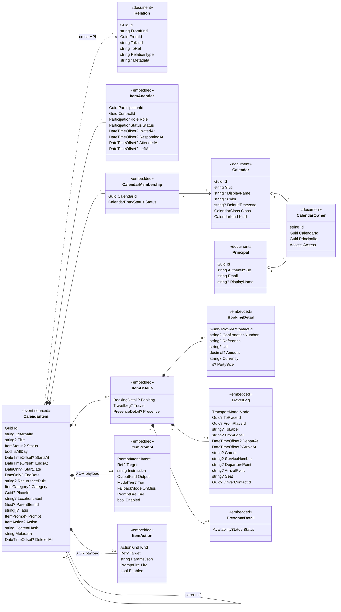

# Architecture

How LupiraCalApi is built: the persistence model, the domain, the ownership/identity model, and how
operation outcomes map onto each transport. Everything here is the *present* state of the code; it is
deliberately environment-agnostic (no host names, ports, or identity-provider specifics).

## Solution shape

Two projects enforce the layering at compile time:

- **`LupiraCalApi.Core`** — the bounded context with no ASP.NET dependency: `Domain/` (aggregates,
  events, value objects, enums + Marten registration), `Application/` (services + the transport-neutral
  `OpResult`), `Auth/` (`AccessResolver`), `Dtos/`, `Mappers/`, `Serialization/`.
- **`LupiraCalApi`** — a thin web host over Core: `Endpoints/` (route maps) → `Handlers/` (resolve the
  caller, call a service, map the result), `Http/` (`OpResult` → HTTP), `Dav/` (the LAN-only
  `/dav-backend` seam the LupiraDavApi gateway consumes), `Mcp/` (agent tools), `Auth/`, `Health/`,
  and `Program.cs` (composition root).

## Persistence: hybrid event sourcing on one Marten store

A single Marten store in one Postgres schema (`MartenRegistrations.UseLupiraCal`). Three kinds of state:

- **Event-sourced aggregates** — `CalendarItem`. An event stream with an **inline snapshot** projection
  (read-your-write). Its full history (scheduled, revised, cancelled, attendee invited/responded,
  added-to/removed-from calendar, prompt/action set/cleared, …) lives in the event log; the snapshot is
  the current read model. Embedded read models (`Attendees`, `Calendars`, `Details`, the event-bound
  `Prompt`/`Action`) ride *on* the snapshot — there are no separate projection tables for them.
- **Plain documents** — `Principal`, `Calendar`, `CalendarOwner`, `Relation`. Reference/identity/sharing
  data whose history isn't event-worthy. Indexed by the fields services query on
  (`Principal.AuthentikSub`/`Email`, `CalendarOwner.PrincipalId`/`CalendarId`, `Relation.FromId`).
- **Operational relational state** — `cal.scheduled_fire`, a plain Npgsql table (not a Marten document)
  written by the scheduling materializer. It is transient, rebuildable from the items, so it sits
  deliberately outside event sourcing (see *Scheduling / firing*).

Enums serialize as strings. Aggregates use deterministic stream ids derived from the iCalendar UID,
so a DAV `DELETE` followed by a `PUT` of the same UID resurrects the same stream. **Structured domain fields
are canonical**: the `/dav-backend` seam regenerates ICS on demand from them, and `ContentHash` (the DAV ETag)
is derived deterministically from that canonical form — no source blob is stored. Schema is applied deliberately
via a one-shot `--apply-schema` run (`ApplyAllConfiguredChangesToDatabaseAsync`, which also creates
`cal.scheduled_fire`), not on boot — there are no EF migrations. One background process runs: the Marten
**async daemon**, hosting the scheduling materializer.

## Bounded context

**In scope** — calendaring (items, recurrence expansion, kinds), first-class participation, item↔calendar
curation, geo place references (LupiraGeoApi), multi-owner sharing of calendars, opaque cross-API relations,
calendar classification (agenda vs. agent-managed system calendars), event-bound payloads (an LLM prompt or
a deterministic action that fires at a time), a derived completeness signal over items, and the firing
**materializer** that computes *what is due*.

**Out of scope for the API host** — the identity provider (external OIDC); contacts and address books
(LupiraContactApi — attendees/details reference contacts by bare Guid, validated via `IContactResolver`
when configured); the DAV protocol itself (the LupiraDavApi gateway — this service only implements the
`/dav-backend` contract, see [dav-backend-contract.md](dav-backend-contract.md)); tasks/portfolio/activity
(owned by other services, referenced only through `Relation`); interpreting the fired payload
(assistant-api's job); and invitation delivery (iTIP/iMIP). **Fire
delivery/dispatch** lives in this repo as the separate `lupira-cal-worker` host (`src/LupiraCalApi.Worker`,
image `danbro96/lupira-cal-worker`): it claims due rows and pushes them to assistant-api.

## Domain model

Solid arrows are references within this API; `*--` is composition (the embedded value object is part of the
aggregate snapshot); dotted `..>` is a by-reference link to another service via `Relation`.
`ItemAttendee.ContactId`, `BookingDetail.ProviderContactId`, and `TravelLeg.DriverContactId` are bare Guids
referencing LupiraContactApi contacts (validated via `IContactResolver` when configured). A `CalendarItem`
belongs to **zero-or-many** `Calendar`s through its embedded `CalendarMembership` list, and only an
`Accepted` membership is exposed on the DAV seam.

### Item↔calendar curation

A `CalendarItem` is calendar-independent. Its membership of a calendar is a `CalendarMembership` entry with a
`CalendarEntryStatus`: an automated source can create an item and **propose** it; a member **accepts** it
into zero-or-many calendars (or it's **removed** — kept as a sync tombstone). An item with no accepted
membership is "unfiled".

### Participation

Each attendee is an embedded `ItemAttendee` keyed by `ParticipationId` and referencing a LupiraContactApi
contact by bare Guid. The timestamps (`InvitedAt`/`RespondedAt`/`AttendedAt`/`LeftAt`) are the recorded
times of the participation events folded into the snapshot; `Status` is the latest RSVP. "No-show" is
derived, not stored. When the contact hop is configured (`Contacts:BaseUrl`), an invite validates the id
via `IContactResolver` (fail-open: an unreachable resolver never blocks the write).

### Places

Places live in **LupiraGeoApi**, not here. A calendar item (`PlaceId` + denormalized `LocationLabel`) and a
travel leg (`ToPlaceId`/`FromPlaceId` + `ToLabel`/`FromLabel`) reference a geo place by id (no FK, no local
catalog). Free-text locations are resolved once at write time via `IGeoResolver` (the host's `GeoApiClient`
→ geo, or a no-op when geo is unconfigured, in which case the label is the raw text). The denormalized
label means ICS generation and the read DTOs never call geo. `GET /items/by-place/{placeId}` is the
reverse index (items at a geo place).

## Enumerations

| Enum | Members | Maps to |
|---|---|---|
| `ItemStatus` | `Tentative` · `Confirmed` · `Cancelled` | iCalendar VEVENT `STATUS` |
| `ItemCategory` | `General` · `Meeting` · `Appointment` · `Meal` · `Occasion` · `Outing` · `Trip` · `Stay` · `Activity` · `Focus` · `Chore` | a calendar event's semantic type |
| `TransportMode` | `Flight` · `Train` · `Metro` · `Tram` · `Bus` · `Coach` · `Car` · `Ferry` · `Bike` · `Walk` · `Other` | mode of a `TravelLeg` (a `Trip`) |
| `CalendarClass` | `Agenda` · `System` | agenda (user-facing, DAV-projected) vs. agent-managed system calendar |
| `CalendarKind` | `Personal` · `Group` · `Birthdays` · `Availability` · `Inbox` · `LlmPrompts` · `UserCheckIn` · `DevOps` · `FoodPlan` · `Generic` | a calendar's purpose within the standard set |
| `AvailabilityStatus` | `Office` · `Home` · `Vacation` · `Sick` · `Leave` | a presence segment's status |
| `CalendarEntryStatus` | `Proposed` · `Accepted` · `Removed` | curation state of an item in a calendar |
| `ParticipationRole` | `Chair` · `RequiredParticipant` · `OptionalParticipant` · `NonParticipant` | iCalendar `ROLE` |
| `ParticipationStatus` | `NeedsAction` · `Accepted` · `Declined` · `Tentative` · `Delegated` | iCalendar `PARTSTAT` |
| `Access` | `Owner` · `ReadWrite` · `Read` | a principal's permission on a container |

## Item details

`ItemDetails` is a composable carrier of optional value objects — a `Booking`, a `TravelLeg`, and/or a `Presence`
segment — independent of `CalendarItem.Category`. Any combination may be set (a booked flight carries both `Booking`
and `Travel`). Location reuses the item's `PlaceId` + `LocationLabel`; provider/driver references are bare
LupiraContactApi contact ids. Bills and deliveries are not modeled here — they live in LupiraTasks and are
surfaced on the agenda via a `Relation`.

| Detail | Applies to | Key fields |
|---|---|---|
| `Booking` (`BookingDetail`) | any category | `ProviderContactId`, `ConfirmationNumber`, `Reference`, `Url`, `Amount`, `Currency`, `PartySize` |
| `Travel` (`TravelLeg`) | a `Trip` | `Mode`, `ToPlaceId`/`ToLabel`, `FromPlaceId`/`FromLabel`, `DepartAt`, `ArriveAt`, `Carrier`, `ServiceNumber`, `DeparturePoint`, `ArrivalPoint`, `Seat`, `DriverContactId` (`ToPlace` free-text required on write) |
| `Presence` (`PresenceDetail`) | authored via the request's `Availability` field | `Status` (whole-day or timed presence segment; a day may hold several) |

## Calendar classification

Each `Calendar` carries a `CalendarClass` and a `CalendarKind`. **Agenda** calendars are the user's own
(Personal, Group, Birthdays, Availability, FoodPlan); **System** calendars are agent-managed scaffolding
(Inbox, LlmPrompts, UserCheckIn, DevOps) that the assistant owns via ordinary `Owner` grants. `POST /me/bootstrap`
seeds the standard set per principal, idempotently (matched on `CalendarKind`). **Only `Agenda` calendars are
projected on the DAV seam** — System calendars are REST/DB-only, which is how DAV stays non-bearing. The REST
DTOs keep the `type` discriminator (now always `calendar`) for wire compatibility with generated clients.

## Event-bound payloads

A `CalendarItem` may carry **exactly one** payload (XOR) that fires at a time: an `ItemPrompt` (an LLM-interpreted,
contracted agent run) **or** an `ItemAction` (a deterministic action, no LLM — e.g. `SendCheckIn` delivering a
frozen message). Payloads are event-sourced (`ItemPromptSet`/`Cleared`, `ItemActionSet`/`Cleared`) and
**server-side only — never emitted to DAV**, like `Metadata`. This service *stores* the payload and *materializes*
when it is due; it does not interpret or deliver it. Set/clear via `PUT`/`DELETE /items/{id}/prompt|action`
(`409` if the other payload is already present).

| Enum | Members |
|---|---|
| `PromptIntent` | `EnrichRecord` · `Research` · `CreateFollowUp` · `Monitor` · `Summarise` · `AskUser` |
| `OutputKind` | `RecordEdit` · `Event` · `Task` · `Message` · `Summary` · `Question` · `Relation` · `None` |
| `ModelTier` | `Small` · `Medium` · `Large` (vendor-neutral; the LLM gateway maps each to a concrete model alias) |
| `FallbackMode` | `Retry` · `Ask` · `Drop` (on a missed contract; default `Retry` = retry-once-then-ask) |
| `ActionKind` | `SendCheckIn` · `Notify` · `CreateLinkedTask` · `ExpireTarget` · `RescheduleSelf` · `RunJob` · `Rescore` |
| `RefKind` | `Event` · `Contact` · `Task` · `External` (the `Ref` a payload acts on) |
| `PromptFireKind` | `OnStart` · `OnEnd` · `Offset` (minutes) · `AllDayAt` (local time) |

## Completeness

A derived `Completeness` (a `0..1` score, the unmet fields ranked heaviest-first, and a `rubricVersion`) is exposed
on `GET /items` to drive the assistant's elicitation/enrichment ranking. It is computed by
`CompletenessResolver`/`CompletenessScorer` at read time — **not stored on the snapshot** — because exemption
depends on the item's *calendar* kinds. The rubric
is category-aware (a `Trip` needs from/to + carrier; a `Meeting` needs location/attendees) and scores *presence*, not
quality (`1` present · `0.5` weak · `0` absent). Exempt records score `null` (not applicable): system-calendar /
Birthdays / Availability-calendar items, any item with a `Presence` segment, and any item carrying a fired payload.
`GapSeverity` is `Weak`|`Absent`.

## Scheduling / firing

The schedule **intent** is event-worthy and lives on the item as its `Prompt`/`Action` payload. The **firing** is
transient operational state in a plain `cal.scheduled_fire` table (raw Npgsql, not a Marten document; the same
split as location/health-api), rebuildable from the items. A **materializer** — a Marten async-daemon
`EventProjection` reacting to `ItemPromptSet`/`ItemActionSet`/`ItemRevised` (and clearing on clear/delete/cancel) —
expands the fired payload + `RecurrenceRule` into rows over a rolling 35-day horizon, idempotent on
`dedupe_key` (`item_id + occurrence_at`); a nightly hosted sweep advances the far edge (and picks up one-shots
beyond the window at set-time). `expire_after` keys off the `PromptFire` timing and the calendar kind. Each row
is stamped from one resolved `FireContext` — fire calendar id, kind→`expire_after`, owning `principal_id` — so
the three can never disagree. The **dispatcher** is the separate `lupira-cal-worker` host
(`src/LupiraCalApi.Worker`): every 15 s it expires over-age rows, claims a due batch (`FOR UPDATE SKIP LOCKED`
+ a 60 s lease), re-reads the item aggregate, and pushes the fire to assistant-api `POST /fires`
(accept-then-own: 202 → `done`; transient failure → `pending` with 30 s→30 m backoff, max 5 attempts →
`failed`; a gone/cleared payload → `expired`). The API host owns *what is due*; the worker owns delivery.

## DAV seam

The DAV **protocol** (CalDAV XML, WebDAV methods, Basic auth) lives in the LupiraDavApi gateway; this service
implements the internal [`/dav-backend` contract](dav-backend-contract.md) — a **secondary, non-bearing** view
over the canonical structured fields. Reads regenerate ICS deterministically on demand (`ICalSerializer.From`;
the location is the item's denormalized `LocationLabel`), and the ETag is the `ContentHash` derived from that
same canonical form, so it is stable across reads. A `PUT` parses the raw blob into structured fields (no blob
is retained); calendar-query time-range filtering (incl. recurrence expansion via `TimeRangeFilter`) runs here,
server-side. The sync token is Marten's global event sequence; deletions and membership removals surface as
tombstones in the changes feed. Only `Agenda` calendars and an item's `Accepted` memberships are exposed; the
seam is LAN-only, service-authed (the gateway's `azp`), and acts on behalf of the `{email}` path principal.

## Ownership & identity

Identity is a thin local `Principal` document, JIT-provisioned on first login (`PrincipalDirectory`):

- **`AuthentikSub`** (the OIDC `sub`, or `email|<email>` when no `sub`) is the durable anchor; **`Email`** is a
  mutable lookup attribute. Resolution is **by `sub` first, then email**, so an OIDC login and the
  `/dav-backend` acting-user email of the same person converge on one principal; email/display name are
  refreshed each login.
- **No single owner.** Access to a `Calendar` is a set of `CalendarOwner` membership documents, each with an
  `Access` level. A "family" calendar is simply several `Owner` grants.
- `AccessResolver` answers the authorization questions: a principal may **read** a container it holds any
  grant on, **write** one it holds `Owner` or `ReadWrite` on, and **manage co-owner grants** only on a
  container it holds `Owner` on. An item is readable/writable iff the principal can read/write some calendar
  the item is **accepted** into.
- Grants are by **email** and provision the target principal on the spot (you can share ahead of someone's
  first login); the composite id `"{containerId:N}:{principalId:N}"` makes re-granting an upsert. Revoking the
  last `Owner` is refused (`OwnerGrants.WouldOrphan`).

## Operation outcomes & transport mapping

Services never throw for expected outcomes; they return a transport-neutral `OpResult`/`OpResult<T>` carrying
an `OpStatus`. Each surface adapts it to its own wire shape.

| `OpStatus` | REST (`OpResultMap` → `TypedResults`) | DAV seam | MCP (`CalendarTools`) |
|---|---|---|---|
| `Ok` | `200 OK` (+ value) / `204 No Content` | `2xx` | tool result value |
| `NotFound` | `404 Not Found` | `404` | `McpException "Not found."` |
| `Forbidden` | `403` + RFC 7807 problem+json | `403` | `McpException` (error) |
| `Invalid` | `400` + RFC 7807 problem+json | `400` | `McpException` (error) |
| `Conflict` | `409` + RFC 7807 problem+json | `412` (If-Match/If-None-Match precondition) | `McpException` (error) |

REST handlers declare precise `Results<...>` unions so the OpenAPI contract is exact; problem responses are
emitted through `Http/Problems` as `application/problem+json` with `{ type, title, detail, status }`. A status
a given result shape can't represent is a programming error and throws.

## Cross-API relations

`Relation` is the single cross-context edge: a by-reference link from an item (`FromKind`/`FromId`)
to something in another service (`ToKind`/`ToRef`, e.g. a task or a portfolio engagement) with a
`RelationType`. There is **no foreign key** — integrity is by convention, which keeps this service decoupled
from the services it links to.
