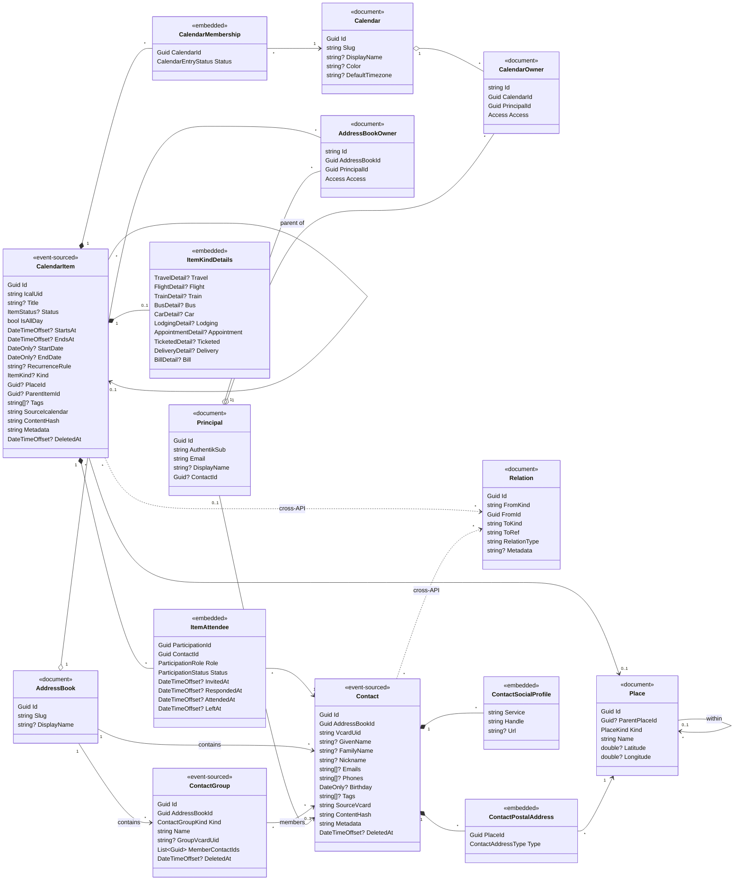

# Architecture

How LupiraCalApi is built: the persistence model, the domain, the ownership/identity model, and how
operation outcomes map onto each transport. Everything here is the *present* state of the code; it is
deliberately environment-agnostic (no host names, ports, or identity-provider specifics).

## Solution shape

Two projects enforce the layering at compile time:

- **`LupiraCalApi.Core`** — the bounded context with no ASP.NET dependency: `Domain/` (aggregates,
  events, value objects, enums + Marten registration), `Application/` (services + the transport-neutral
  `OpResult`), `Auth/` (`AccessResolver`), `Dtos/`, `Mappers/`, `Serialization/`.
- **`LupiraCalApi`** — a thin web host over Core: `Endpoints/` (route maps) → `Handlers/` (resolve the
  caller, call a service, map the result), `Http/` (`OpResult` → HTTP), `Dav/` (CalDAV/CardDAV router),
  `Mcp/` (agent tools), `Auth/`, `Health/`, and `Program.cs` (composition root).

## Persistence: hybrid event sourcing on one Marten store

A single Marten store in one Postgres schema (`MartenRegistrations.UseLupiraCal`). Two kinds of state:

- **Event-sourced aggregates** — `CalendarItem`, `Contact`, `ContactGroup`. Each is an event stream with
  an **inline snapshot** projection (read-your-write). Their full history (scheduled, revised, cancelled,
  attendee invited/responded, added-to/removed-from calendar, …) lives in the event log; the snapshot is
  the current read model. Embedded read models (`Attendees`, `Calendars`, `Addresses`, `Profiles`,
  `KindDetails`) ride *on* the snapshot — there are no separate projection tables for them.
- **Plain documents** — `Principal`, `Calendar`, `AddressBook`, `CalendarOwner`, `AddressBookOwner`,
  `Place`, `Relation`. Reference/identity/sharing data whose history isn't event-worthy. Indexed by the
  fields services query on (`Principal.AuthentikSub`/`Email`, the owner docs' `PrincipalId`/container id,
  `Place.Name`, `Relation.FromId`).

Enums serialize as strings. Aggregates use deterministic stream ids derived from the iCalendar/vCard UID,
so a DAV `DELETE` followed by a `PUT` of the same UID resurrects the same stream. The raw
`SourceIcalendar`/`SourceVcard` blob and its `ContentHash` (the DAV ETag) are carried on events and returned
byte-for-byte over DAV; the hash is never recomputed. Schema is applied deliberately via a one-shot
`--apply-schema` run (`ApplyAllConfiguredChangesToDatabaseAsync`), not on boot — there are no EF migrations.

## Bounded context

**In scope** — calendaring (items, recurrence expansion, kinds), contacts (vCards, groups/organizations),
first-class participation, item↔calendar curation, a shared hierarchical place catalog, multi-owner sharing
of containers, and opaque cross-API relations.

**Out of scope** — the identity provider (external OIDC for `/api`, an LDAP directory for `/dav` Basic
auth); tasks/portfolio/activity (owned by other services, referenced only through `Relation`); and
scheduling/invitation delivery (iTIP/iMIP) — intentionally not modeled.

## Domain model

Solid arrows are references within this API; `*--` is composition (the embedded value object is part of the
aggregate snapshot); dotted `..>` is a by-reference link to another service via `Relation`. A `Contact`
belongs to exactly one `AddressBook`; a `CalendarItem` belongs to **zero-or-many** `Calendar`s through its
embedded `CalendarMembership` list, and only an `Accepted` membership is exposed over DAV.

### Item↔calendar curation

A `CalendarItem` is calendar-independent. Its membership of a calendar is a `CalendarMembership` entry with a
`CalendarEntryStatus`: an automated source can create an item and **propose** it; a member **accepts** it
into zero-or-many calendars (or it's **removed** — kept as a sync tombstone). An item with no accepted
membership is "unfiled".

### Participation

Each attendee is an embedded `ItemAttendee` keyed by `ParticipationId` and referencing a `Contact`. The
timestamps (`InvitedAt`/`RespondedAt`/`AttendedAt`/`LeftAt`) are the recorded times of the participation
events folded into the snapshot; `Status` is the latest RSVP. "No-show" is derived, not stored. "Me" is the
`Contact` referenced by `Principal.ContactId`.

### Places

`Place` is a shared hierarchical catalog (`ParentPlaceId` links Address → City → Country). Both a calendar
item (`PlaceId`) and a contact's postal address (`ContactPostalAddress.PlaceId`) point at a node, so a city
and a full street address coexist and roll up, and cities/countries are entered once.

### Contacts & groups

Names are structured vCard parts (no stored full name — it's composed); the raw `FN` survives in
`SourceVcard`. `Emails`/`Phones` are arrays; postal addresses reference `Place`; social profiles are open
`Service`/`Handle`/`Url` triples. A contact's employer is **membership in an `Organization`-kind
`ContactGroup`**, not a free-text field; `MemberContactIds` is maintained by add/remove events.

## Enumerations

| Enum | Members | Maps to |
|---|---|---|
| `ItemStatus` | `Tentative` · `Confirmed` · `Cancelled` | iCalendar VEVENT `STATUS` |
| `ItemKind` | `Generic` · `Travel` · `Flight` · `Train` · `Bus` · `Car` · `Lodging` · `Appointment` · `Ticketed` · `Delivery` · `Bill` | selects the `ItemKindDetails` member |
| `CalendarEntryStatus` | `Proposed` · `Accepted` · `Removed` | curation state of an item in a calendar |
| `ParticipationRole` | `Chair` · `RequiredParticipant` · `OptionalParticipant` · `NonParticipant` | iCalendar `ROLE` |
| `ParticipationStatus` | `NeedsAction` · `Accepted` · `Declined` · `Tentative` · `Delegated` | iCalendar `PARTSTAT` |
| `ContactGroupKind` | `Group` · `Organization` | personal grouping vs. company/institution |
| `ContactAddressType` | `Home` · `Work` · `Other` | vCard `ADR` TYPE |
| `Access` | `Owner` · `ReadWrite` · `Read` | a principal's permission on a container |
| `PlaceKind` | `Country` · `City` · `Address` · `Venue` | level of a `Place` tree node |

## Item-kind details

`ItemKindDetails` is a flat record carrier holding optional kind-specific records; the populated one matches
`CalendarItem.Kind`. Location reuses the item's `PlaceId`; provider references reuse a `Contact` id. (The
Flight/Train/Bus/Car records conceptually extend `TravelDetail` but are modeled as flat siblings.)

| `ItemKind` | Detail record | Key fields |
|---|---|---|
| `Travel` | `TravelDetail` | `ToPlaceId` (required), `FromPlaceId`, `DepartAt`, `ArriveAt`, `Carrier`, `BookingReference` |
| `Flight` | `FlightDetail` | `FlightNumber`, `Terminal`, `Gate`, `GateClosesAt`, `SeatAssignment`, `BaggageAllowance` |
| `Train` | `TrainDetail` | `TrainNumber`, `Coach`, `Seat`, `DeparturePlatform`, `ArrivalPlatform` |
| `Bus` | `BusDetail` | `Operator`, `ServiceNumber`, `DepartureStop`, `ArrivalStop`, `SeatReservation` |
| `Car` | `CarDetail` | `DriverContactId`, `Vehicle`, `LicensePlate`, `PickupPlaceId`, `DropoffPlaceId` |
| `Lodging` | `LodgingDetail` | `ConfirmationNumber`, `CheckInAt`, `CheckOutAt`, `RoomType`, `Provider` |
| `Appointment` | `AppointmentDetail` | `ProviderContactId`, `AppointmentType`, `ReferenceNumber`, `PreparationNotes` |
| `Ticketed` | `TicketedDetail` | `Performer`, `Seat`, `TicketReference`, `DoorsOpenAt`, `Provider` |
| `Delivery` | `DeliveryDetail` | `Carrier`, `TrackingNumber`, `TrackingUrl`, `OrderReference` |
| `Bill` | `BillDetail` | `Amount`, `Currency`, `Payee`, `InvoiceNumber`, `PaidAt` |

## Ownership & identity

Identity is a thin local `Principal` document, JIT-provisioned on first login (`PrincipalDirectory`):

- **`AuthentikSub`** (the OIDC `sub`, or `email|<email>` when no `sub`) is the durable anchor; **`Email`** is a
  mutable lookup attribute. Resolution is **by `sub` first, then email**, so the OIDC (`/api`) and
  Basic-over-LDAP (`/dav`) logins of the same person converge on one principal; email/display name are
  refreshed each login.
- **No single owner.** Access to a `Calendar`/`AddressBook` is a set of `CalendarOwner`/`AddressBookOwner`
  membership documents, each with an `Access` level. A "family" container is simply several `Owner` grants.
- `AccessResolver` answers the authorization questions: a principal may **read** a container it holds any
  grant on, **write** one it holds `Owner` or `ReadWrite` on, and **manage co-owner grants** only on a
  container it holds `Owner` on. An item is readable/writable iff the principal can read/write some calendar
  the item is **accepted** into.
- Grants are by **email** and provision the target principal on the spot (you can share ahead of someone's
  first login); the composite id `"{containerId:N}:{principalId:N}"` makes re-granting an upsert. Revoking the
  last `Owner` is refused (`OwnerGrants.WouldOrphan`).

## Operation outcomes & transport mapping

Services never throw for expected outcomes; they return a transport-neutral `OpResult`/`OpResult<T>` carrying
an `OpStatus`. Each surface adapts it to its own wire shape.

| `OpStatus` | REST (`OpResultMap` → `TypedResults`) | DAV | MCP (`CalendarTools`) |
|---|---|---|---|
| `Ok` | `200 OK` (+ value) / `204 No Content` | `2xx` | tool result value |
| `NotFound` | `404 Not Found` | `404` | `McpException "Not found."` |
| `Forbidden` | `403` + RFC 7807 problem+json | `403` | `McpException` (error) |
| `Invalid` | `400` + RFC 7807 problem+json | `400` | `McpException` (error) |
| `Conflict` | `409` + RFC 7807 problem+json | `412` (If-Match/If-None-Match precondition) | `McpException` (error) |

REST handlers declare precise `Results<...>` unions so the OpenAPI contract is exact; problem responses are
emitted through `Http/Problems` as `application/problem+json` with `{ type, title, detail, status }`. A status
a given result shape can't represent is a programming error and throws.

## Cross-API relations

`Relation` is the single cross-context edge: a by-reference link from an item or contact (`FromKind`/`FromId`)
to something in another service (`ToKind`/`ToRef`, e.g. a task or a portfolio engagement) with a
`RelationType`. There is **no foreign key** — integrity is by convention, which keeps this service decoupled
from the services it links to.
