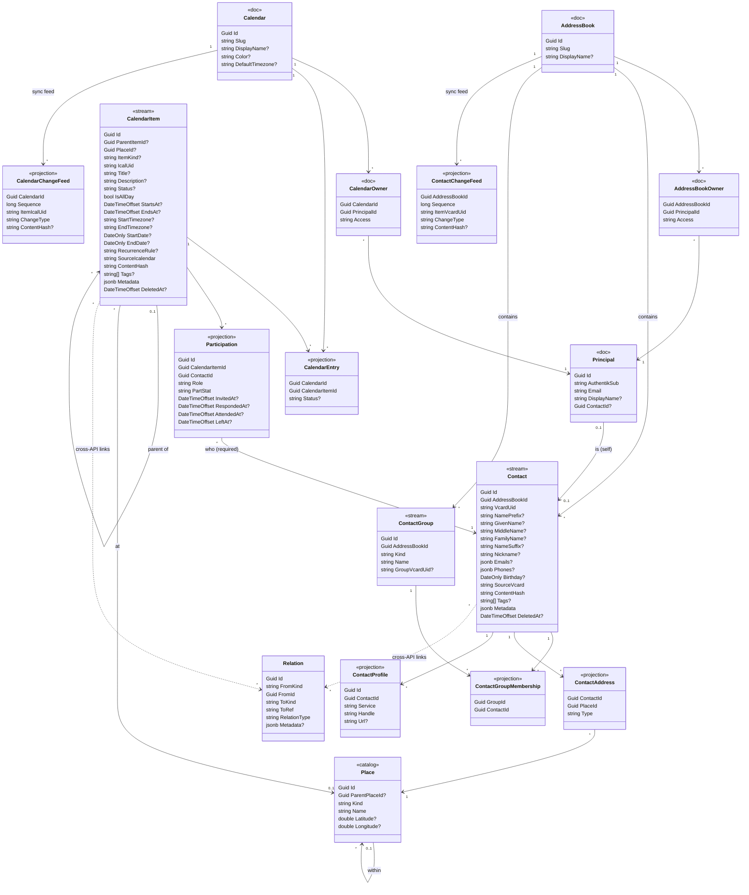
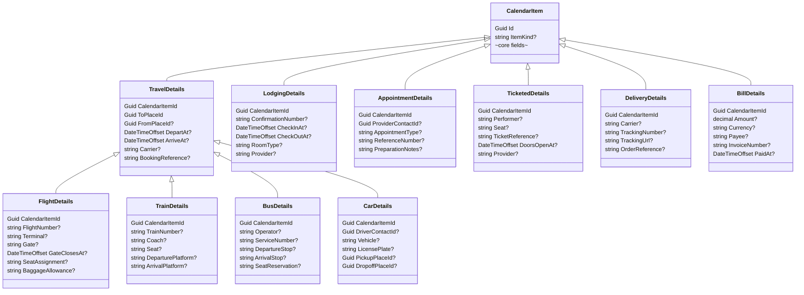

# LupiraCalApi — data model & boundaries

The agreed conceptual data model and service boundaries for the Calendar + Contacts service. The store is **primarily structured for usability, secondarily for simple mapping to DAV/iCalendar.**

## Locked decisions

1. **Two APIs.** *Calendar + Contacts* in one service (this repo); *Activity/Portfolio* (Engagement/Project/Goal/Skill) as a separate dedicated API (the evolution of LupiraWeb). Identity stays in Authentik.
2. **Publish bridge.** The Activity API is authoritative on accomplishments and publishes completed ones, one-way, as read-only all-day items into a dedicated "Activity" calendar. The Calendar API is authoritative on attendance.
3. **Multiple owners.** No single owner; access is a membership relation (`owner`/`read-write`/`read`).
4. **Resources are event-sourced; collections are plain.** `CalendarItem`, `Contact`, `ContactGroup` are the event **streams**. `Principal`, `Calendar`, `AddressBook`, `CalendarOwner`, `AddressBookOwner`, `Place` are plain **documents**. Everything else is a **projection** off a stream.
5. **`CalendarItem` ↔ `Calendar` is many-to-many** (via the `CalendarEntry` projection): an item exists independently, so automated sources can create one and **propose** it; you **accept** it into zero-or-many calendars. Only accepted entries are exposed over DAV.
6. **All-Marten; derived sync feeds.** Per-collection `CalendarChangeFeed`/`ContactChangeFeed` projections; the CalDAV/CardDAV sync-token is Marten's global event `Sequence` (opaque, monotonic). No `Revision` column.

> **Conventions:** `?` marks a nullable column. Stereotypes: `<<stream>>` = event-sourced aggregate, `<<doc>>` = plain document, `<<projection>>` = read model derived from a stream, `<<catalog>>` = shared reference data.

## Candidate bounded contexts

| Context | Owns | External surface | Boundary |
|---|---|---|---|
| **Identity** | `Principal` (doc) | OIDC | External (Authentik); thin local doc |
| **Calendaring** | **stream** `CalendarItem`; **docs** `Calendar`, `CalendarOwner`; **projections** `CalendarEntry`, `Participation`, *(kind-detail tables)*, `CalendarChangeFeed` | CalDAV + REST + MCP | Core of **this** API |
| **Contacts** | **streams** `Contact`, `ContactGroup`; **docs** `AddressBook`, `AddressBookOwner`; **projections** `ContactGroupMembership`, `ContactAddress`, `ContactProfile`, `ContactChangeFeed` | CardDAV + REST | **Same API** |
| **Shared** | `Place` (catalog, used by both items and contacts) | — | In this API |
| **Activity / Portfolio** | `Engagement`, `Project`, `Goal`, `Skill`, `Artifact`, `MediaAsset` | REST / résumé site | **Dedicated API** (LupiraWeb evolves into it) |
| *(glue)* | `Relation` | — | Generic cross-context edge |

## Sync = derived per-collection feed + global `Sequence`

- Because items/contacts are independent streams (and items are shared across calendars), per-collection sync is a **derived projection**: `CalendarChangeFeed` (keyed by `CalendarId`) and `ContactChangeFeed` (by `AddressBookId`).
- **Token** = Marten's global event `Sequence` — opaque, append-assigned, strictly monotonic (RFC 6578 only needs opacity + comparability). No `Revision` counter, no hand-written change rows.
- **sync-collection REPORT** = feed rows with `Sequence > token`, reduced to latest-per-uid (`200`+etag for saved, `404` tombstone for deleted / removed-from-calendar); new token = max `Sequence`.
- The calendar feed reacts to both **content** changes (item events) and **membership/curation** changes (`CalendarEntry` events); only `accepted` entries are exposed.
- **getctag** = the calendar's max `Sequence`. **Per-resource `If-Match`** = the resource's `ContentHash`; per-stream optimistic concurrency via `FetchForWriting`.

## Conceptual class model (Calendar + Contacts API)

Solid `-->` = real reference within this API; dotted `..>` = soft cross-API reference via `Relation`. A `Contact` belongs to one `AddressBook`; a `CalendarItem` belongs to **zero-or-many** `Calendar`s through `CalendarEntry`.

## Item-kind hierarchy (table-per-type)

- **Realization:** each box is a 1:1 projection table keyed by `CalendarItemId` (TPT). A flight has `CalendarItem` + `TravelDetails` + `FlightDetails`; `ItemKind` = the leaf (`flight`). `TravelDetails.ToPlaceId` is **required** (a destination), referencing `Place`. Flight/Train/Bus/Car extend `TravelDetails`; Lodging/Appointment/Ticketed/Delivery/Bill extend `CalendarItem` **directly**. Location uses the item's `PlaceId`; provider references (`ProviderContactId`) reuse `Contact`.
- **History:** setting/changing these are events on the `CalendarItem` stream (`TravelBooked`, `FlightGateChanged`, `FlightDelayed`).

### Modeled now / backlog

**Modeled now:** the **Travel** family (Flight/Train/Bus/Car) plus **Lodging**, **Appointment**, **Ticketed**, **Delivery**, **Bill**. **Backlog** (same TPT pattern, add later): **Reservation/Dining**, **Birthday/Anniversary** (links a `Contact`), **Class/Lesson**, **Shift/Work**, **Deadline/Due** (links `Project`/`Goal`), **Service/Maintenance**.

## Vocabulary glossary (all stored as enum/string columns with check constraints)

| Vocabulary | Values | Purpose |
|---|---|---|
| `ItemStatus` (`CalendarItem.Status`) | tentative / confirmed / cancelled | Item status (iCalendar VEVENT `STATUS`) |
| `ItemKind` | generic / travel / flight / train / bus / car / lodging / appointment / ticketed / delivery / bill | Specialized-item discriminator → selects the detail table |
| `CalendarEntry.Status` | proposed / accepted | Curation state of an item within a calendar |
| `ContactGroup.Kind` | group / organization | Personal grouping vs a company/institution |
| `PartStat` | needs-action / accepted / declined / tentative / delegated | Attendee RSVP (iCalendar `PARTSTAT`) |
| `Role` | chair / req-participant / opt-participant / non-participant | Attendee role (iCalendar `ROLE`) |
| `Place.Kind` | country / city / address / venue | Level of a `Place` tree node |
| `Access` | owner / read-write / read | A principal's permission on a collection |
| `ContactAddress.Type` | home / work / other | Kind of a contact's postal address (vCard `ADR` TYPE) |

`ContactProfile.Service` (facebook/telegram/linkedin/…) is an **open string**, not a constrained enum.

## Modeling notes

- **Many-to-many + curation.** `CalendarEntry` (projection of `AddedToCalendar`/`RemovedFromCalendar`/`CurationStatusChanged` events on the item stream) links an item to a calendar with `Status` ∈ `proposed`/`accepted`. Automated sources create an item and propose it; you accept (→ DAV-visible) or reject (→ removed). An item with no accepted entry is "unfiled".
- **Ownership (`CalendarOwner`/`AddressBookOwner`).** Plain membership docs; `Access` ∈ `owner`/`read-write`/`read`; ≥1 `owner`; `owner` adds member-management + delete rights.
- **`Place` (hierarchical catalog).** Shared by items and contacts. `Kind` = level, `ParentPlaceId?` = enclosing place; an item or contact-address points at any node, so "Stockholm" and a full address coexist and roll up; cities/countries entered once.
- **Contact addresses use `Place`.** `ContactAddress` rows (`Type` home/work/other) → `address`-kind `Place` nodes, **not** jsonb. Parsed from vCard `ADR` (raw `SourceVcard` round-trips verbatim); `Place` auto-provisioned/de-duped like an item location. `Emails`/`Phones` stay jsonb.
- **Contact names.** Structured vCard `N` parts + `Nickname?`. **No stored `FullName`** — composed from the parts; raw `FN` preserved verbatim in `SourceVcard`.
- **`ContactGroup` (incl. organizations).** `Kind` ∈ `group` | `organization`. **A contact's employer is membership in an `organization`-kind group — no free-text `Organization` field.** Membership add/remove are events → history; `ContactGroupMembership` is the projection. vCard `ORG` synthesized from the org-group name on export, resolved/created on import.
- **Social profiles (`ContactProfile`).** Many per contact: `Service` (open string), `Handle`, `Url?`. Maps to vCard `IMPP`/`X-SOCIALPROFILE`.
- **`Participation`.** Required `ContactId` (every participant is a `Contact`; auto-provisioned into the acting principal's primary address book, de-duped by normalized email — these sync to the phone). A **projection**: timestamps are *composed* from the participation events (each carrying an explicit time); `PartStat` is the latest response. **No `NoShow`** (derived). **No `IsSelf`** — "me" is the `Contact` from `Principal.ContactId`.
- **Principal ↔ Contact (`Principal.ContactId?`).** Links an Authentik principal to its own `Contact`.
- **Parent/child items (`ParentItemId?`).** A "Vacation" parent owns heterogeneous children; maps to iCal `RELATED-TO`; distinct from **recurrence**.
- **`Relation`** is the only cross-API edge.

## Event sourcing (unified per-resource model)

- **Aggregates / streams:** `CalendarItem`, `Contact`, `ContactGroup` (deterministic stream ids support DELETE-then-PUT resurrection).
- **Plain documents:** `Principal`, `Calendar`, `AddressBook`, `CalendarOwner`, `AddressBookOwner`, `Place`.
- **Projections (inline):** the `CalendarItem`/`Contact` snapshots; `CalendarEntry`; `Participation`; kind-detail tables; `ContactAddress`; `ContactProfile`; `ContactGroupMembership`; `CalendarChangeFeed`/`ContactChangeFeed`.
- **Sample item domain events:** lifecycle, recurrence, `ItemIcsPut` (verbatim), participation, kind-details, membership/curation.
- **Fidelity:** carry raw `SourceIcalendar`/`SourceVcard` + `ContentHash` in events; projections store the latest; never recompute the hash; DAV-PUT blobs returned byte-for-byte.
- **Cost:** raw blobs in each put-event grow `mt_events`; acceptable at personal scale.

## The "what I did" publish bridge

Attendance is owned by **Calendaring** via `Participation`. Accomplishments ("done") are owned by the **Activity API**, which **publishes** completed engagements/projects as **read-only all-day items** into a reserved `activity` calendar (one-way, accepted `CalendarEntry`), cross-linked via `Relation`. The Activity API stays the source of truth.

## Activity/Portfolio API — tables (the dedicated service)

| Table | Key fields | Relations |
|---|---|---|
| `Engagement` | Kind, Institution, Start, End?, Summary?, Titles[] | `1 → * Project` |
| `Project` | EngagementId?, Title, Start?, End?, Status | belongs to `Engagement?` |
| `Goal` | SkillId?, TargetMaturity, Deadline?, Status | targets a `Skill?` |
| `Skill` | Name, Category, ParentSkillId?, CurrentMaturity (+ timeline edge events) | self-ref hierarchy |
| `Artifact`, `MediaAsset` | external evidence / images | link to Project/Skill/Engagement |

Cross-links back to the Calendar API are **never FKs** — they flow through `Relation`.
