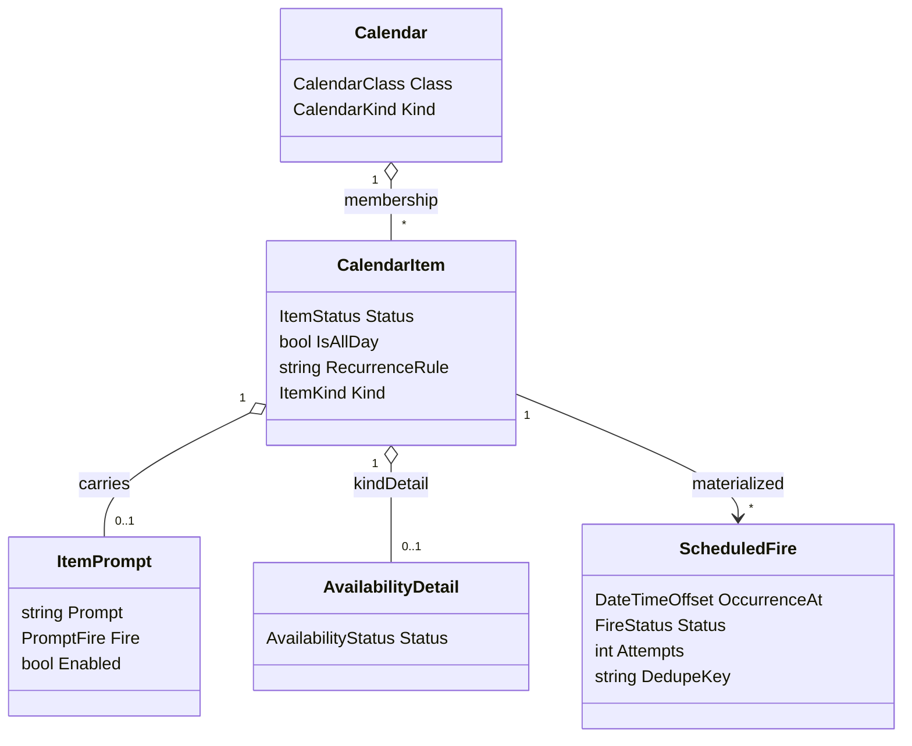
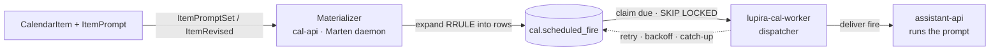

# Temporal backbone — calendar classes, event-bound prompts, scheduling

**Status:** design (green-field — API deployed, not yet in use, so DB/event/endpoint changes are open).
**Primacy:** REST + the `cal` Marten store are primary. **CalDAV/CardDAV is secondary and bears on nothing here** — system calendars and prompts are never projected to DAV.

The LupiraAssistant product uses this service as its **universal scheduling and temporal substrate**: multiple purpose-built calendars (agenda + system) plus prompts that fire at a time. Most of the model already supports this; the only substantial new piece is the firing engine.

## What already supports it

| Need | Already in the code |
|---|---|
| Many calendars per owner | `Calendar` doc + `CalendarOwner` grants (`Domain/Calendar.cs`, `Domain/CalendarOwner.cs`) |
| Sharing | `CalendarOwner` / `AddressBookOwner` — Owner / ReadWrite / Read |
| **Inbox → committed lifecycle** | the **curation model** — one `CalendarItem`, `CalendarMembership` in several calendars, each with `CalendarEntryStatus { Proposed, Accepted, Removed }`, driven by the curation endpoints (`/proposed`, `/accept`) |
| Tentative / holds | `ItemStatus.Tentative` |
| Recurrence | `CalendarItem.RecurrenceRule` (RRULE, expanded at query time) |
| All-day / timed | `IsAllDay` + `StartsAt`/`EndsAt` + `StartDate`/`EndDate` |
| Trips (parent + legs) | `ParentItemId` + Travel/Flight/Train `ItemKindDetails` |
| Topic slicing | `Tags[]` + `Metadata` JSONB |
| Cross-links | `Relation` (`FromId` → `ToRef`) |

**Headline:** the Inbox→committed flow needs no new mechanism — it is the existing curation model. A captured event is `AddedToCalendar(Inbox, Accepted)`; proposing it is `AddedToCalendar(Personal, Proposed)`; approving is `CalendarEntryStatusChanged(Personal, Accepted)`; dismissing leaves it in Inbox only.

## Domain additions



### 1. Calendar classification — `Domain/Calendar.cs`
Two new fields on the plain document (no event sourcing):
```
CalendarClass Class   // Agenda | System
CalendarKind  Kind    // Personal | Group | Birthdays | Availability | Inbox | Prompts | DevOps | FoodPlan | Generic
```
- Agenda views and the DAV projection include `Class == Agenda` only. **System calendars (CheckIns, DevOps) are REST/DB-only — never DAV.** That is how DAV stays non-bearing.
- Seed the standard set per principal at provisioning.
- `Group` replaces a more specific "Family" — one shared-calendar kind covers household, family, or team.

### 2. Event-bound prompt — `Domain/CalendarItem.cs`, `Domain/CalendarItemEvents.cs`
An optional structured prompt on **any** item, event-sourced:
```
record ItemPrompt(string Prompt, PromptFire Fire, bool Enabled);
PromptFire = OnStart | OnEnd | Offset(int minutes) | AllDayAt(TimeOnly local)
event ItemPromptSet(Guid ItemId, ItemPrompt Prompt);
event ItemPromptCleared(Guid ItemId);
```
- `Apply(...)` updates the inline snapshot.
- REST: `PUT /items/{id}/prompt`, `DELETE /items/{id}/prompt`. Server-side only, like `Metadata` — never in ICS.
- Any agenda item may carry one (a tagged event); System-calendar items always do — a **Prompts** item and a **DevOps** routine are just items carrying an `ItemPrompt` that fires.

### 3. Availability — partial-day status segments
- `ItemKind.Availability` + `AvailabilityDetail(AvailabilityStatus Status)`, `Status = Office | Home | Vacation | Sick | Leave`.
- **Not forced all-day:** an item may be whole-day (Office) or timed via `StartsAt`/`EndsAt`, so a single day can hold *office 08:00–12:00* + *home 13:00–17:00* as two segments. `RecurrenceRule` carries the default week; per-day changes are ordinary items/overrides.
- The assistant resolves "status at instant T" from the covering segment(s); split days fall out naturally.

### 4. Canonical fields; iCal/vCard becomes a projection
Today `SourceIcalendar` / `SourceVcard` are stored as the DAV source of truth, and DAV PUT is authoritative for the blob. Since DAV is secondary:
- **Structured domain fields become canonical.** Drop the stored source blobs as source of truth; **generate ICS/vCard on demand** for DAV responses; derive `ContentHash`/ETag from canonical state.
- DAV PUT parses into structured fields (no blob retained); `ItemIcsPut` / `ContactVcardPut` become parse-to-fields events rather than blob-store events.
- This removes the last place iCal semantics shape the model.

### 5. Completeness score (derived — drives Elicit prioritisation)
A derived `Completeness` on the `CalendarItem` read model, scoring how well-documented an event is. It is the signal the assistant uses to decide *which* events to check in about.

- **Derived in the snapshot projection, not a hand-set field.** A pure function of the item's fields, computed when the inline snapshot is built — so it is recomputed on **every** modification for free, with no event and no write-path wiring. A one-time projection **rebuild** backfills every existing event; that is the point — it surfaces the **old, thin events** that never get touched. (Don't leave them null-until-modified, or they're never rankable.)
- **`null` = not applicable**, not "unscored": Birthdays, Availability segments, Inbox feed items, and system Prompts/DevOps are exempt — never a check-in target. A number means "assessed".
- **Kind-aware rubric** (`ItemKind` + `KindDetails`): a Flight needs flight#/gate; an Appointment needs provider/location; a meeting needs attendees + location; a Birthday needs nothing. A flat field-count would wrongly flag birthdays.
- **Store completeness only, never the time-weighted priority** — `f(completeness, proximity)` is time-dependent and would go stale every minute; the assistant computes it at selection time.
- **Rubric changes = a projection rebuild** (Marten); a `rubricVersion` on the score makes drift detectable.
- Exposed on the item read model + `GET /items` so the assistant can pull and rank.

**Rough scoring sketch (first cut — tunable, carries a `rubricVersion`):**

Weighted field coverage, evaluated per kind:
```
score = Σ(weightᵢ × presenceᵢ) / Σ(weightᵢ)      // 0..1 over the kind's expected fields
presence ∈ { 1 = present, 0.5 = weak/partial, 0 = absent }
exempt kinds → null (not scored)
```
`presence = 0.5` captures partial info the assistant can upgrade — a location that's a city but not a venue, attendees listed but none RSVP'd, a description that just echoes the title.

Expected fields + rough starting weights, by `ItemKind`:

| Kind | Expected fields (weight) |
|---|---|
| Meeting / generic timed | location (2) · attendees (2) · time (1) · description (1) · travel-if-away (1, conditional) |
| Appointment | location (2) · provider contact (2) · time (1) · prep notes (1) · reference (1) |
| Flight | flight no. (2) · depart/arrive times (1) · gate/terminal (1) · booking ref (1) · seat (0.5) |
| Travel / Train / Bus | from→to place (2) · depart/arrive times (1) · carrier (1) · booking ref (1) · seat (0.5) |
| Birthday · Availability · Inbox · Prompts · DevOps | — exempt → `null` |

Conditional fields count only when relevant (travel/leave-by only if the venue isn't home; attendees only for shared/meeting kinds, not a solo focus block). The scorer returns the **absent/weak fields ranked by weight** next to the number — that ranked gap list is what the assistant asks about, heaviest gap first. It scores *presence*, not *quality* — crude on purpose, enough to rank thin-vs-rich; the assistant's phrasing handles nuance.

**Assistant usage (assistant-api, not cal-api) — two streams:**
- *Upcoming clarifications (urgent):* rank applicable upcoming events by `(1 − completeness) × proximity`; over a threshold, schedule a **Prompts** event asking the specific gaps (the same scorer returns the missing fields on demand).
- *Historical backfill (low priority, batched):* old thin events have ~zero proximity urgency → an occasional "fill in the past" pass, not the urgent stream.

## Standard calendar set
- **Agenda:** Personal · Group · Birthdays (from contacts) · Availability · FoodPlan *(later)*.
- **System:** Inbox (all external events, source of truth; curation proposes from here) · Prompts (the assistant's scheduled prompt work — Elicit questions, research, follow-ups; prompts commonly spawn prompts) · DevOps (recurring ops prompts).

## Boundary with tasks-api
The calendar owns things that **fire** — a moment of action. Work **tracked to completion with no firing moment** (an unhealthy-service fix, a standing "watch for X" goal) lives in LupiraTasksApi, not here. The two compose via `Relation(FromKind="item", ToKind="task")`: a monitor task can own a recurring Prompt event, and a Prompt that surfaces work can spawn a task.

## Scheduling / firing engine

The schedule **intent** is event-worthy and lives on the item as `ItemPrompt`. The **firing** is transient operational state — a plain relational concern, not Marten, rebuildable from the items (same split as the raw Npgsql tables in location/health-api). Three layers:



1. **`cal.scheduled_fire`** — plain table (not event-sourced):
   `id · item_id · calendar_id · occurrence_at · prompt_ref · status(pending|claimed|done|failed|expired) · attempts · locked_until · dedupe_key(item_id + occurrence_at) · expire_after · last_error · fired_at`, indexed on `(status, occurrence_at)`.
2. **Materializer** — in cal-api, via the Marten async daemon reacting to `ItemPromptSet` / `ItemRevised`: expands `ItemPrompt` + `RecurrenceRule` into rows over a rolling horizon; idempotent on `dedupe_key`; extends the horizon periodically.
3. **Dispatcher** — a **separate process, not the cal-api host**. Claims due rows (`... WHERE status=pending AND occurrence_at <= now() FOR UPDATE SKIP LOCKED`), delivers each fire to assistant-api (which runs the prompt), then marks done / retries with backoff.

This buys exactly what a raw calendar lacks:
- **catch-up** — rows whose time passed while down stay `pending` and fire late (or go `expired` past `expire_after`);
- **idempotency** — `dedupe_key` = one fire per occurrence across retries/restarts;
- **retry/backoff** — `attempts` + `locked_until`.

**Ownership:** cal-api owns "what's due" (it has the items, prompts, RRULE); assistant-api runs the fired prompt. The same queue is the clock for Prompts (Elicit, research, follow-ups), DevOps routines, *and* ordinary reminders/leave-by — built once.

### Dispatcher options (dispatch lives outside the cal-api host)
- **A — dedicated `lupira-cal-worker` + the Postgres `scheduled_fire` queue (recommended).** SKIP-LOCKED claim loop; zero new infrastructure; full control of catch-up/expiry; the florence/gpt host+worker pattern.
- **B — Quartz.NET in the worker (Postgres ADO job store).** Cron + retry + misfire (catch-up) handling out of the box; less hand-rolling, one dependency.
- **C — RabbitMQ delayed messages.** cal-api publishes a delayed message per fire; the worker consumes. Adds a broker; worth it only if a general event bus is wanted anyway.

### Fire delivery (cal-worker → assistant-api)
With the dedicated worker, the worker is the active dispatcher, so it **pushes** each claimed fire to assistant-api's inbound-signal intake — the same "event-bound prompt fired" signal the assistant already ingests. cal-api itself stays free of outbound calls; only the worker, whose whole job is dispatch, makes the call.

**Handoff = accept-then-own.** assistant-api durably records the fire and dedups on `dedupe_key` before returning `202 Accepted`; the worker then marks the row `done`. Ownership transfers at the ack — assistant-api runs the prompt from its own intake on its own retry. This matters because gpt-api is slow (CPU, 10–90 s model swaps): the worker must not block on prompt execution.

**Failure modes — all no-loss:**
- assistant-api down → push fails → row stays `pending`; worker backs off and retries; catch-up covers the gap.
- worker down → rows wait in `scheduled_fire`; catch-up fires them on restart.
- ack lost after assistant-api persisted → worker re-pushes → assistant-api dedups on `dedupe_key` → no double-run.

Pull (assistant-api polls `GET /due-fires`) is rejected: it moves the claim/retry/catch-up loop into assistant-api, leaving the dedicated worker with nothing to do and leaking cal's queue semantics into the brain.

### Defaults
Personal-scale starting values (tune later):

| Knob | Value | Why |
|---|---|---|
| Materializer horizon | 35 days | covers a month + weekly/monthly recurrences with buffer |
| Horizon extension | event-driven on `ItemPromptSet`/`ItemRevised` + a nightly sweep advancing the far edge | changed items materialise at once; recurring items keep a rolling window |
| `expire_after` — reminders & leave-by | 30 min | a late "leave now" is worse than none |
| `expire_after` — Prompts | 6 hours | act/ask while the day is still relevant |
| `expire_after` — DevOps routines | 3 days | not time-critical; fine to run late after downtime |
| `expire_after` — fallback (unset) | 24 hours | fire if late within a day, else expire |
| Dispatcher tick | 15 s | sub-minute firing for leave-by without hammering PG |
| Claim batch | 50 rows | trivial at personal scale |
| `locked_until` (claim lease) | 60 s | exceeds the push+ack round-trip; stuck claims reclaim after |
| Max attempts | 5, backoff 30 s → 1 m → 5 m → 15 m → 30 m | bounded retry on assistant-api hiccups |

`expire_after` keys off the prompt's calendar kind, with the 24 h fallback for anything unclassified.

## Open decisions — resolved
1. ✅ Dispatcher: **dedicated `lupira-cal-worker` + Postgres `scheduled_fire` queue (A)**.
2. ✅ Fire delivery: **push** (cal-worker → assistant-api intake, accept-then-own + dedupe).
3. ✅ Calendar kind name: **`Prompts`** (was CheckIns/Questions) — the calendar literally holds prompts, and prompts commonly spawn prompts after research/aggregation.
4. ✅ Materializer + dispatcher defaults: see Defaults above.
5. ✅ Completeness rubric: **generic, in cal-api** — cheap, sortable, any consumer benefits; assistant-api layers proximity/thresholds on top.
