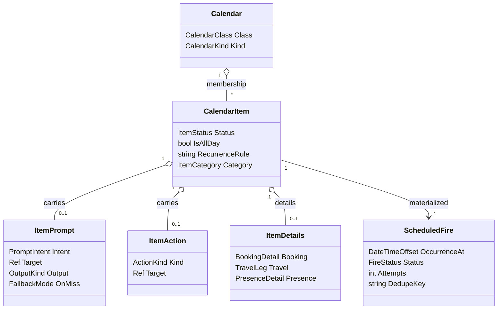
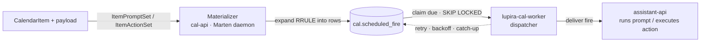

# Temporal backbone — calendar classes, event-bound prompts, scheduling

**Status:** design record — the **intended final state** + rationale; it does not track build status. As-built structure: [architecture.md](architecture.md); implementation status + remaining work: `LupiraAssistantMobile/docs/roadmap.md`.
**Primacy:** REST + the `cal` Marten store are primary. **CalDAV/CardDAV is secondary and bears on nothing here** — system calendars and prompts are never projected to DAV.

**Implementation notes** (where the build refined the sketch below):
- **Completeness** is computed in the service/mapper layer at read time, *not* in the snapshot projection: exemption needs the item's *calendar* kinds (and a contact's organisation lives on a separate `ContactGroup`), neither visible to a single-stream snapshot. A `null` `ItemCategory` scores under the generic rubric.
- **`ModelTier`** is a vendor-neutral `Small | Medium | Large` enum; the LLM gateway maps each to a concrete model alias (so the stored tier survives gateway model swaps).
- **`cal.scheduled_fire`** is created via idempotent raw DDL (run inside `--apply-schema`), not a Marten-managed table; the materializer is a `partial` `EventProjection` writing rows through `QueueSqlCommand` on the async daemon.
- Value objects (`PromptFire`, `Ref`, `PresenceDetail`) are flattened-union records, matching the `ItemDetails` convention.

The LupiraAssistant product uses this service as its **universal scheduling and temporal substrate**: multiple purpose-built calendars (agenda + system) plus prompts that fire at a time. Most of the model already supports this; the only substantial new piece is the firing engine.

## What already supports it

| Need | Already in the code |
|---|---|
| Many calendars per owner | `Calendar` doc + `CalendarOwner` grants (`Domain/Calendar.cs`, `Domain/CalendarOwner.cs`) |
| Sharing | `CalendarOwner` / `AddressBookOwner` — Owner / ReadWrite / Read |
| **Inbox → committed lifecycle** | the **curation model** — one `CalendarItem`, `CalendarMembership` in several calendars, each with `CalendarEntryStatus { Proposed, Accepted, Removed }`, driven by the curation endpoints (`/proposed`, `/accept`) |
| Tentative / holds | `ItemStatus.Tentative` |
| Recurrence | `CalendarItem.RecurrenceRule` (RRULE, expanded at query time) |
| All-day / timed | `IsAllDay` + `StartsAt`/`EndsAt` + `StartDate`/`EndDate` |
| Trips (parent + legs) | `ParentItemId` + `ItemDetails.Travel` (`TravelLeg` with `TransportMode`) |
| Topic slicing | `Tags[]` + `Metadata` JSONB |
| Cross-links | `Relation` (`FromId` → `ToRef`) |

**Headline:** the Inbox→committed flow needs no new mechanism — it is the existing curation model. A captured event is `AddedToCalendar(Inbox, Accepted)`; proposing it is `AddedToCalendar(Personal, Proposed)`; approving is `CalendarEntryStatusChanged(Personal, Accepted)`; dismissing leaves it in Inbox only.

## Domain additions



### 1. Calendar classification — `Domain/Calendar.cs`
Two new fields on the plain document (no event sourcing):
```
CalendarClass Class   // Agenda | System
CalendarKind  Kind    // Personal | Group | Birthdays | Availability | Inbox | LlmPrompts | UserCheckIn | DevOps | FoodPlan | Generic
```
- Agenda views and the DAV projection include `Class == Agenda` only. **System calendars (CheckIns, DevOps) are REST/DB-only — never DAV.** That is how DAV stays non-bearing.
- Seed the standard set per principal at provisioning — idempotent bootstrap (matched on `CalendarKind`, plus a `personal` address book) via REST `POST /me/bootstrap`, MCP `bootstrap_me`, or automatically on first DAV contact. `FoodPlan` is an enum value, deliberately unseeded.
- `Group` replaces a more specific "Family" — one shared-calendar kind covers household, family, or team.

### 2. Event-bound payload — `Domain/CalendarItem.cs`, `Domain/CalendarItemEvents.cs`
A fired item carries exactly one **payload** — either an LLM-interpreted `ItemPrompt` or a deterministic `ItemAction` (XOR). The payload is event-sourced; `Apply(...)` updates the inline snapshot; it is server-side only, like `Metadata` — never in ICS.
```
record ItemPrompt(            // LLM, contracted → agent run
  PromptIntent Intent,        // EnrichRecord | Research | Monitor | Summarise — CreateFollowUp/AskUser retired (run outputs, not intents)
  Ref?         Target,        // {Kind: event|contact|task|external, Id/Url} the run acts on
  string       Instruction,   // detail, scoped by Intent + Target
  OutputKind   Output,        // RecordEdit | Event | Task | Message | Summary | Question | Relation | None
  string[]?    Tools,         // tool allowlist for this run
  ModelTier?   Tier,          // gateway alias: qwen3-1.7b | qwen3-14b | gpt-oss-120b
  FallbackMode OnMiss,        // Retry | Ask | Drop  (default: Retry-once → Ask)
  PromptFire   Fire, bool Enabled );

record ItemAction(            // deterministic, no LLM → executed directly
  ActionKind Kind,            // SendCheckIn | Notify | CreateLinkedTask | ExpireTarget | RescheduleSelf | RunJob | Rescore
  Ref?       Target,
  string     ParamsJson,      // SendCheckIn carries the frozen message + optional follow-up Prompt ref
  PromptFire Fire, bool Enabled );

PromptFire = OnStart | OnEnd | Offset(int minutes) | AllDayAt(TimeOnly local)
event ItemPromptSet(Guid ItemId, ItemPrompt Prompt);   event ItemPromptCleared(Guid ItemId);
event ItemActionSet(Guid ItemId, ItemAction Action);   event ItemActionCleared(Guid ItemId);
```
- The contract is **declared at authoring time** (when the intent is known) and **enforced by assistant-api** at fire time: it constrains the agent run (tool allowlist, tier, structured output, bound `Target`), validates the produced `ProposedAction` against `Intent`/`Target`/`Output`, and on a miss retries once then applies `OnMiss`. cal-api stores the payload; it does not interpret it. Run behaviour is an assistant-side **profile** keyed `(Intent × Target.Kind)` — see `assistant-backbone.md → Agent run profiles`.
- **LlmPrompts** and **DevOps** items carry an `ItemPrompt` (agent run) or an `ItemAction` (direct execute). **UserCheckIn** items carry `ItemAction(SendCheckIn)`: a frozen message authored at scheduling time, delivered at fire with no LLM, plus a `Relation(item → item, "follow-up")` to the `ItemPrompt` that processes the answer.
- `ExpireTarget` is the only fired close (at a deadline: task → close, prompt/event → cancel); result-driven complete/cancel is inline free CRUD, not a fired action.
- REST: `PUT /items/{id}/prompt`, `PUT /items/{id}/action`, and `DELETE` each. Server-side; never in ICS.

### 3. Item taxonomy — `ItemCategory` + composable `ItemDetails`
- `ItemCategory { General, Meeting, Appointment, Meal, Occasion, Outing, Trip, Stay, Activity, Focus, Chore }` on the item. Details are a **composable bag**, not a per-kind union: `ItemDetails(BookingDetail? Booking, TravelLeg? Travel, PresenceDetail? Presence)` — a booked flight sets `Booking` + `Travel` on one item.
- `TravelLeg(TransportMode Mode, ToPlaceId, FromPlaceId?, DepartAt?, ArriveAt?, Carrier?, ServiceNumber?, DeparturePoint?, ArrivalPoint?, Seat?, DriverContactId?)`; `TransportMode { Flight, Train, Metro, Tram, Bus, Coach, Car, Ferry, Bike, Walk, Other }` — flights/trains are modes of a `Trip` leg, not categories. `BookingDetail(ProviderContactId?, ConfirmationNumber?, Reference?, Url?, Amount?, Currency?, PartySize?)` is category-free.
- **Validation:** `Travel` applies only to `Trip` (and requires `ToPlace`); unknown enum names → 400 listing valid values; partial details are legal (progressive enrichment).
- **Places are canonical location:** `CalendarItem.PlaceId` points into a hierarchical `Place` catalog (`Country → City → Address → Venue`); free-text labels resolve to places on write; DAV ICS renders the label on demand.

### Availability — partial-day presence segments
- A presence item carries `ItemDetails.Presence` = `PresenceDetail(AvailabilityStatus Status)`, `Status = Office | Home | Vacation | Sick | Leave`, on the Availability calendar.
- **Not forced all-day:** an item may be whole-day (Office) or timed via `StartsAt`/`EndsAt`, so a single day can hold *office 08:00–12:00* + *home 13:00–17:00* as two segments. `RecurrenceRule` carries the default week; per-day changes are ordinary items/overrides.
- The assistant resolves "status at instant T" from the covering segment(s); split days fall out naturally.

### 4. Canonical fields; iCal/vCard becomes a projection
Previously `SourceIcalendar` / `SourceVcard` were stored as the DAV source of truth, with DAV PUT authoritative for the blob. Since DAV is secondary:
- **Structured domain fields become canonical.** Drop the stored source blobs as source of truth; **generate ICS/vCard on demand** for DAV responses; derive `ContentHash`/ETag from canonical state.
- DAV PUT parses into structured fields (no blob retained); `ItemImported` / `ContactImported` become parse-to-fields events rather than blob-store events.
- This removes the last place iCal semantics shape the model.

### 5. Completeness score (derived — drives Elicit prioritisation)
A derived `Completeness`, scoring how well-documented a record is, on **both** the `CalendarItem` (events) **and** `Contact` (address book) read models. It is the signal the assistant uses to decide *which* events to clarify and *which* contacts to flesh out.

- **Derived at read time in the service/mapper layer, never stored.** A pure function (`CompletenessScorer`) over the read model — exemption needs the item's *calendar* class/kind and a contact's `ContactGroup` organisation, neither visible to a single-stream snapshot. Nothing persisted means no backfill: old, thin events score the moment they're read.
- **`null` = not applicable**, not "unscored": Birthdays, presence segments, items carrying a fired payload, and everything on System calendars (Inbox, LlmPrompts, UserCheckIn, DevOps) are exempt — never a check-in target. A number means "assessed".
- **Category-aware rubric** (`ItemCategory` + `ItemDetails`): a Trip needs its leg (from→to, times, carrier); an Appointment needs provider + location; a Meeting needs attendees + location; a Birthday needs nothing. A flat field-count would wrongly flag birthdays.
- **Store completeness only, never the weighted priority** — `f(completeness, proximity/relevance)` is context-dependent and would go stale; the assistant computes it at selection time.
- **Rubric changes take effect on the next read** (nothing stored); a `rubricVersion` on the score makes drift detectable.
- Exposed on both read models — `GET /items` and `GET /contacts` — so the assistant can pull and rank.

**Rough scoring sketch (first cut — tunable, carries a `rubricVersion`):**

Weighted field coverage, evaluated per kind:
```
score = Σ(weightᵢ × presenceᵢ) / Σ(weightᵢ)      // 0..1 over the kind's expected fields
presence ∈ { 1 = present, 0.5 = weak/partial, 0 = absent }
exempt kinds → null (not scored)
```
`presence = 0.5` captures partial info the assistant can upgrade — attendees listed but none RSVP'd, a description that just echoes the title.

Expected fields + weights, by `ItemCategory` (`rubricVersion 1`):

| Category | Expected fields (weight) |
|---|---|
| Meeting | location (2) · attendees (2) · time (1) · description (1) |
| Appointment | location (2) · provider contact (2) · time (1) |
| Trip | from→to place (2) · depart/arrive times (1) · carrier (1) · booking (1) · seat (0.5) |
| Stay | location (2) · check-in/out (1) · booking (1) |
| Meal / Outing | location (2) · time (1) · booking (1) |
| General · Occasion · Activity · Focus · Chore | location (2) · time (1) · description (1) |
| Birthdays · presence · fired payloads · System calendars | — exempt → `null` |

The scorer returns the **absent/weak fields ranked by weight** next to the number — that ranked gap list is what the assistant asks about, heaviest gap first. It scores *presence*, not *quality* — crude on purpose, enough to rank thin-vs-rich; the assistant's phrasing handles nuance.

**Contacts** use the same formula with their own rubric (no category — a contact is a person record), computed at read time exactly as for events; organisation = membership of an `Organization`-kind `ContactGroup`, not a contact field:

| Record | Expected fields (weight) |
|---|---|
| Contact | name (1) · first reach method — email, phone, or profile (3) · second reach method (1) · birthday (1) · postal address (1) · organisation (1) |

A contact has no time-proximity, so the assistant prioritises contact enrichment by **completeness × relevance** (the contact is an attendee of an upcoming event, or was recently interacted with) rather than by clock-proximity.

**Assistant usage (assistant-api, not cal-api) — two streams:**
- *Upcoming clarifications (urgent):* rank applicable upcoming events by `(1 − completeness) × proximity`; over a threshold, schedule a **LlmPrompts** event asking the specific gaps (the same scorer returns the missing fields on demand).
- *Historical backfill (low priority, batched):* old thin events have ~zero proximity urgency → an occasional "fill in the past" pass, not the urgent stream.
- *Contact enrichment:* rank low-completeness contacts by **relevance** (upcoming-event attendee · recent interaction); over a threshold, ask the user for the top missing field.

## Standard calendar set
- **Agenda:** Personal · Group · Birthdays (from contacts) · Availability · FoodPlan *(later)*.
- **System (agent-managed; the assistant has full CRUD — see Agent write access):** Inbox (all external events, source of truth; curation proposes from here) · LlmPrompts (LLM instructions — research, follow-ups, answer-processing; carry an `ItemPrompt`) · UserCheckIn (frozen messages to the user — `ItemAction(SendCheckIn)`, delivered at fire, no LLM) · DevOps (recurring ops — `ItemPrompt` or `ItemAction`).

## Agent write access
The assistant owns the **System** calendars (LlmPrompts, UserCheckIn, DevOps) and manages them with **full CRUD** — it freely adds/edits/deletes its own prompts and check-ins. cal-api enforces this with the ordinary `Owner` grant; there is no special path. The *consent-first* gate (ask before writing) is an **assistant-api policy** that applies only to the user's **Agenda** records — it never applies to the assistant's own System scaffolding.

## Boundary with tasks-api
The calendar owns things that **fire** — a moment of action. Work **tracked to completion with no firing moment** (an unhealthy-service fix, a standing "watch for X" goal) lives in LupiraTasksApi, not here. The two compose via `Relation` (`FromKind: item|contact` → `ToKind: task|engagement|project|url`): a monitor task can own a recurring Prompt event, and a Prompt that surfaces work can spawn a task.

## Scheduling / firing engine

The schedule **intent** is event-worthy and lives on the item as its fired payload (`ItemPrompt` or `ItemAction`). The **firing** is transient operational state — a plain relational concern, not Marten, rebuildable from the items (same split as the raw Npgsql tables in location/health-api). Three layers:



1. **`cal.scheduled_fire`** — plain table (not event-sourced):
   `id · item_id · calendar_id · principal_id · occurrence_at · prompt_ref · status(pending|claimed|done|failed|expired) · attempts · locked_until · dedupe_key(item_id + occurrence_at, UNIQUE) · expire_after · last_error · fired_at`, indexed on `(status, occurrence_at)`.
2. **Materializer** — in cal-api, via the Marten async daemon reacting to `ItemPromptSet` / `ItemActionSet` / `ItemRevised`: expands the fired payload + `RecurrenceRule` into rows over a rolling horizon; idempotent on `dedupe_key`; drops future-pending rows on `ItemPromptCleared`/`ItemActionCleared`/`ItemDeleted`/`ItemCancelled`; extends the horizon periodically. When an item sits in several calendars, one **fire context** is chosen (LlmPrompts/DevOps beat agenda; Accepted beats Proposed) and drives `calendar_id`, `expire_after`, and the stamped `principal_id` — they can't disagree; an item in no calendar is not materialised (no principal to deliver as).
3. **Dispatcher** — a **separate process, not the cal-api host**. Expires overdue rows first each tick, then claims due rows (`status = pending` or a lapsed `claimed` lease, `occurrence_at <= now()`, `FOR UPDATE SKIP LOCKED`), **re-loads the item pre-flight** (deleted/cancelled/cleared/disabled → `expired`; unresolvable calendar/principal → `failed` — the row is only the clock; the aggregate is the payload's source of truth at dispatch), delivers each fire to assistant-api, then marks done / retries with backoff.

This buys exactly what a raw calendar lacks:
- **catch-up** — rows whose time passed while down stay `pending` and fire late (or go `expired` past `expire_after`);
- **idempotency** — `dedupe_key` = one fire per occurrence across retries/restarts;
- **retry/backoff** — `attempts` + `locked_until`.

**Ownership:** cal-api owns "what's due" (it has the items, payloads, RRULE); assistant-api runs the fired payload. The same queue is the clock for LlmPrompts (Elicit, research, follow-ups), DevOps routines, *and* ordinary reminders/leave-by — built once.

### Dispatcher options (dispatch lives outside the cal-api host)
- **A — dedicated `lupira-cal-worker` + the Postgres `scheduled_fire` queue (recommended).** SKIP-LOCKED claim loop; zero new infrastructure; full control of catch-up/expiry; the florence/gpt host+worker pattern.
- **B — Quartz.NET in the worker (Postgres ADO job store).** Cron + retry + misfire (catch-up) handling out of the box; less hand-rolling, one dependency.
- **C — RabbitMQ delayed messages.** cal-api publishes a delayed message per fire; the worker consumes. Adds a broker; worth it only if a general event bus is wanted anyway.

### Fire delivery (cal-worker → assistant-api)
With the dedicated worker, the worker is the active dispatcher, so it **pushes** each claimed fire to assistant-api's inbound-signal intake — the same "event-bound prompt fired" signal the assistant already ingests. cal-api itself stays free of outbound calls; only the worker, whose whole job is dispatch, makes the call.

**Handoff = accept-then-own.** assistant-api durably records the fire and dedups on `dedupe_key` before returning `202 Accepted` (`Duplicate=true` on a lost-ack re-push still marks the row done); the worker then marks the row `done`. Ownership transfers at the ack — assistant-api runs the prompt from its own intake on its own retry. This matters because gpt-api is slow (CPU, 10–90 s model swaps): the worker must not block on prompt execution. The delivery carries the typed **payload** verbatim (enums as names) + `ItemId`/`CalendarId`/class/kind/`OccurrenceAt`, the stamped principal resolved to an identity the hub can key grants on, and `ExpireAfter` as an absolute deadline. The payload branches the handling: an **`ItemPrompt`** fire → agent run (LLM); an **`ItemAction`** fire → executed directly, no LLM (`SendCheckIn` delivers the user's frozen message).

**Failure modes — all no-loss:**
- assistant-api down → push fails → row stays `pending`; worker backs off and retries; catch-up covers the gap.
- worker down → rows wait in `scheduled_fire`; catch-up fires them on restart.
- ack lost after assistant-api persisted → worker re-pushes → assistant-api dedups on `dedupe_key` → no double-run.

Pull (assistant-api polls `GET /due-fires`) is rejected: it moves the claim/retry/catch-up loop into assistant-api, leaving the dedicated worker with nothing to do and leaking cal's queue semantics into the brain.

### Defaults
Personal-scale starting values (tune later):

| Knob | Value | Why |
|---|---|---|
| Materializer horizon | 35 days | covers a month + weekly/monthly recurrences with buffer |
| Horizon extension | event-driven on `ItemPromptSet`/`ItemActionSet`/`ItemRevised` + a nightly sweep advancing the far edge | changed items materialise at once; recurring items keep a rolling window |
| `expire_after` — reminders & leave-by | 30 min | a late "leave now" is worse than none |
| `expire_after` — LlmPrompts | 6 hours | act/ask while the day is still relevant |
| `expire_after` — DevOps routines | 3 days | not time-critical; fine to run late after downtime |
| `expire_after` — fallback (unset) | 24 hours | fire if late within a day, else expire |
| Dispatcher tick | 15 s | sub-minute firing for leave-by without hammering PG |
| Claim batch | 50 rows | trivial at personal scale |
| `locked_until` (claim lease) | 60 s | exceeds the push+ack round-trip; stuck claims reclaim after |
| Max attempts | 5, backoff 30 s → 1 m → 5 m → 15 m → 30 m | bounded retry on assistant-api hiccups |

The 30-min bucket keys off the fire **timing** (`Offset` fires = reminders/leave-by — there is no reminder calendar kind); `LlmPrompts` (6 h) and `DevOps` (3 d) key off the calendar kind; anything else falls back to 24 h (also enforced at expiry via `coalesce`).

## Open decisions — resolved
1. ✅ Dispatcher: **dedicated `lupira-cal-worker` + Postgres `scheduled_fire` queue (A)**.
2. ✅ Fire delivery: **push** (cal-worker → assistant-api intake, accept-then-own + dedupe).
3. ✅ Calendar kind name: **`LlmPrompts`** — it holds LLM-instruction prompts, which commonly spawn further prompts after research/aggregation.
4. ✅ Materializer + dispatcher defaults: see Defaults above.
5. ✅ Completeness rubric: **generic, in cal-api** — cheap, sortable, any consumer benefits; assistant-api layers proximity/thresholds on top.
6. ✅ Fired payload is typed: `ItemPrompt` (contracted LLM run) or `ItemAction` (deterministic); the run is validated against the contract, retry-then-`OnMiss` on a miss.
